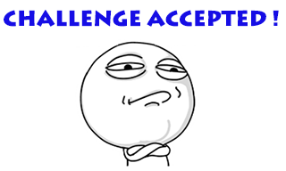

# Try to write my first README article

## 二级标题开始还是用中文吧

假装这儿有正文

### 三级标题只是试着用用

This is a simple tool to draw a triangle, **really, very simple**.  
*And sentences below are just for testing.*

换一段

1. I have no idea what I am doing.
2. I don't know what to do.
   1. This is not working.
   
Tomorrow let's cook something delicious.

*W-H-Y T-H-I-S?*